<picture>
  <source media="(prefers-color-scheme: dark)" srcset="dark.svg">
  <source media="(prefers-color-scheme: light)" srcset="light.svg">
  
</picture>

# 📊 GitHub Stats:
 
 

<!-- Activity Graph — vercel hosted, stable -->

